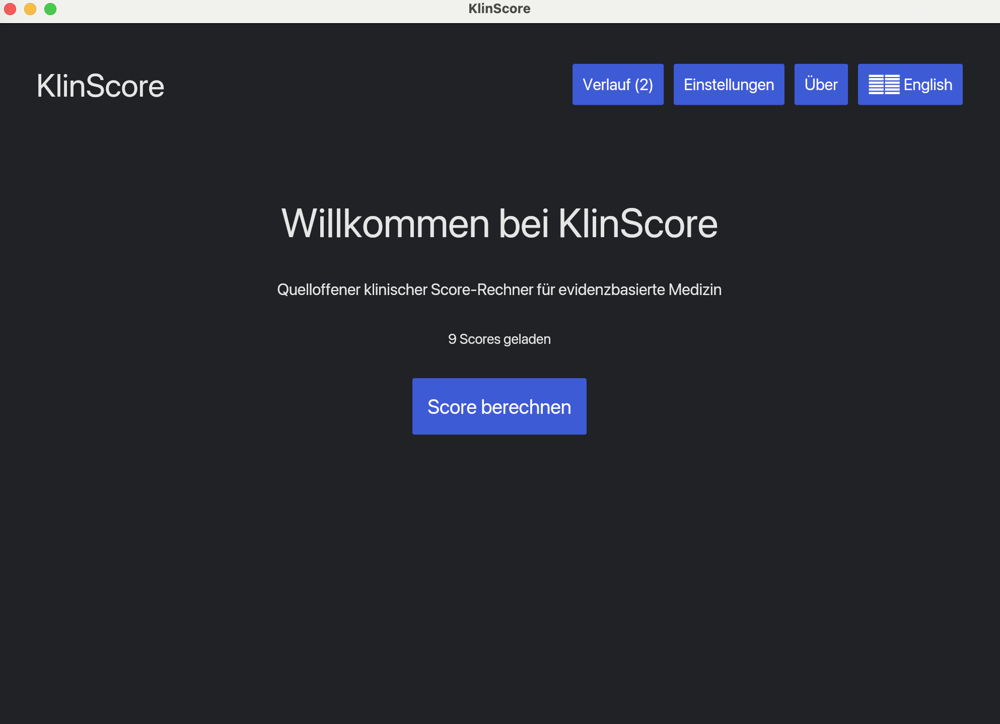
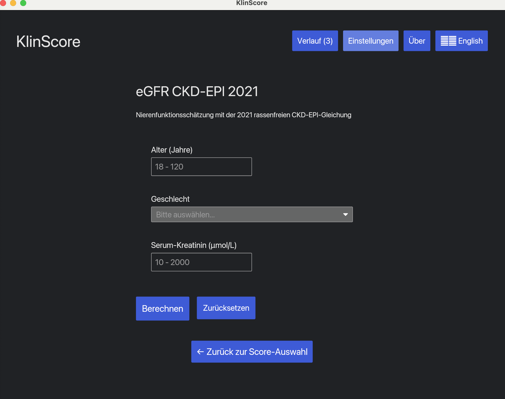
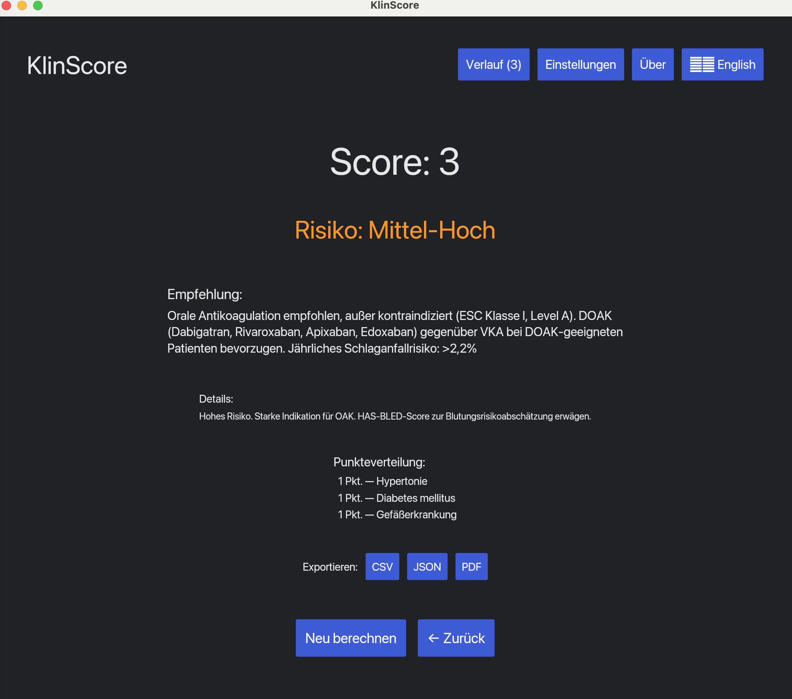
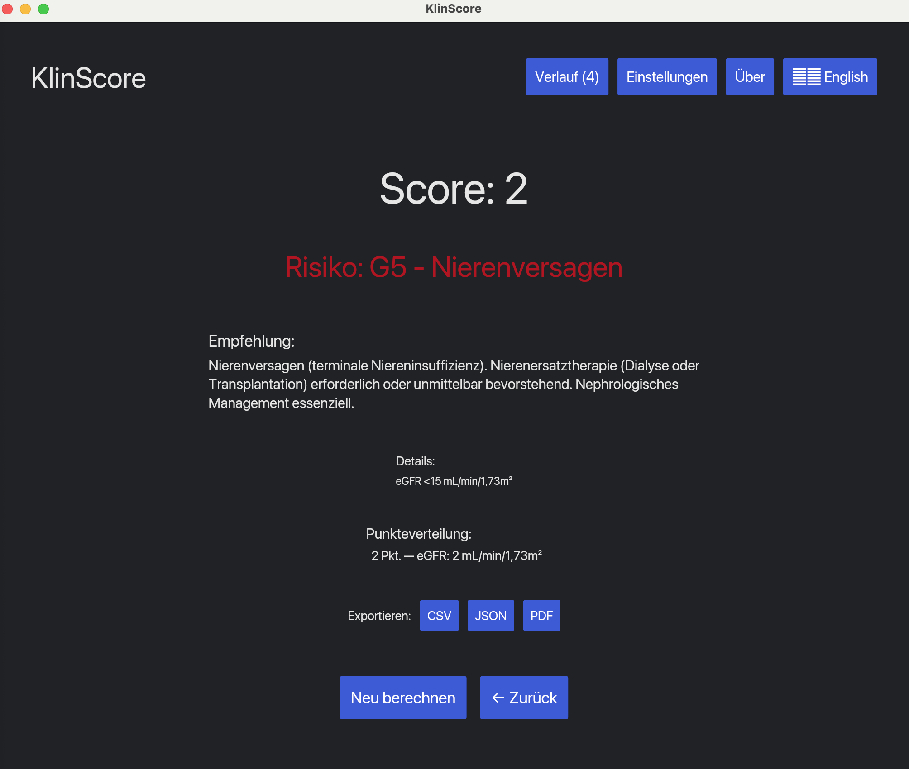
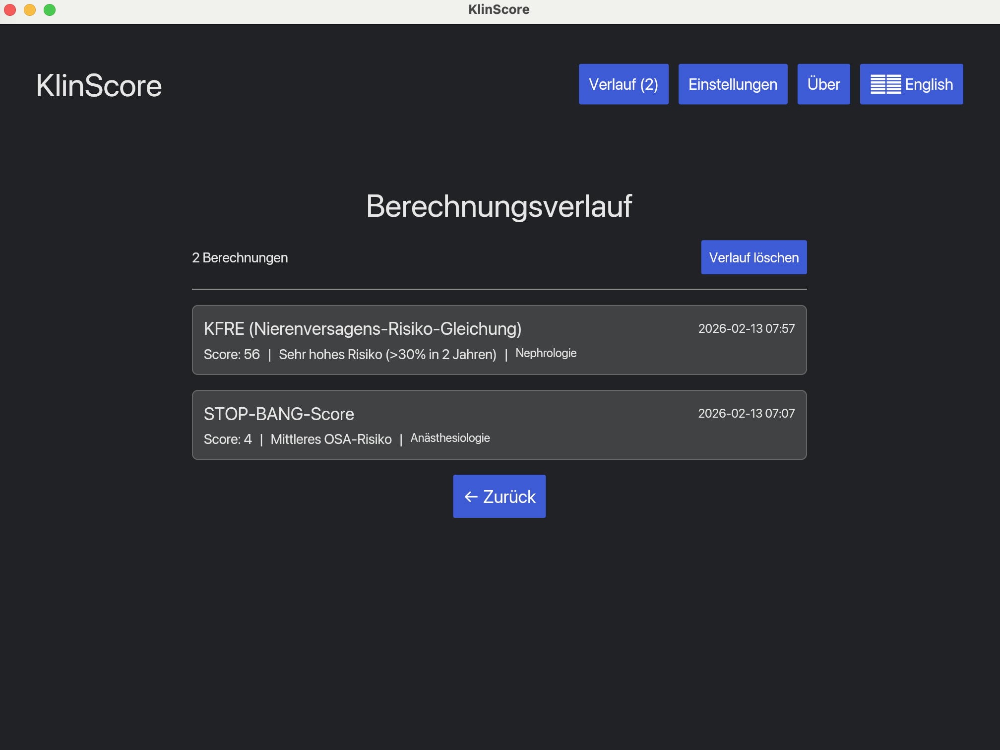
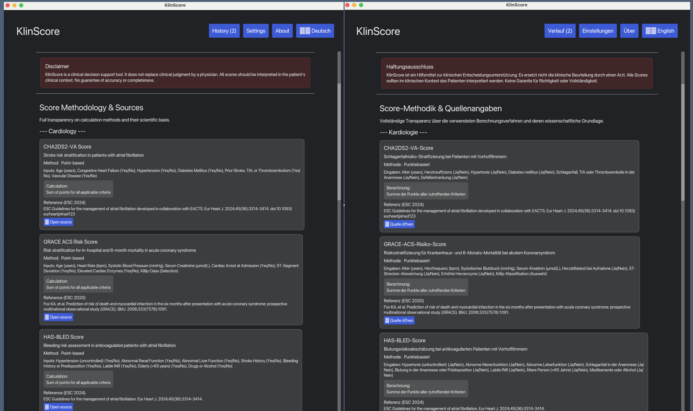

# KlinScore

**Clinical Score Calculator for Evidence-Based Medicine**

A fast, offline-first desktop application for calculating clinical scores used in German and European hospitals. Built with Rust and designed for physician workflows.

<div align="center">

[](LICENSE)
[](https://www.rust-lang.org)
[](tests/)

**[Features](#features) • [Installation](#installation) • [Usage](#usage) • [Scores](#clinical-scores) • [Contributing](#contributing)**

</div>

---

## Screenshots

<div align="center">

### Welcome Screen

*Main screen with specialty cards and score count — shown in German.*

### Score Input Form

*CHA2DS2-VA stroke risk form — checkboxes, age input, and guideline reference.*


*eGFR CKD-EPI 2021 — formula-based score with numeric inputs and unit display.*

### Calculation Results

*Point-based result: color-coded risk level, recommendation, and points breakdown.*


*Formula-based result: computed eGFR value with CKD stage classification.*

### About — Methodology & Sources

*Full transparency: calculation method, formula, inputs, and clickable DOI links for every score.*

### Calculation History

*Session history with score name, result, risk level, and timestamp.*

### English / Deutsch

*Instant language toggle — all labels, recommendations, and risk levels switch between German and English.*

</div>

---

## 🎯 Why KlinScore?

Clinical scores are essential for evidence-based medicine, but existing solutions have problems:

- **MDCalc**: Requires internet, uses outdated scores, no German localization
- **Paper references**: Slow, error-prone, interrupts workflow
- **Hospital systems**: Often don't include specialty-specific scores

**KlinScore solves this:**

✅ **Offline-first** - Works without internet (hospital WiFi problems? No issue)
✅ **Current guidelines** - ESC 2024, KDIGO 2024, ASA 2020, ACCP 2012
✅ **Bilingual** - German and English throughout
✅ **Fast** - Calculate scores in <30 seconds
✅ **Physician-maintainable** - Add new scores via simple YAML files
✅ **Open source** - Free, auditable, community-driven

---

## ✨ Features

### 🩺 Multi-Specialty Coverage

- **Cardiology** - Stroke risk (CHA2DS2-VA), bleeding risk (HAS-BLED), ACS risk (GRACE)
- **Nephrology** - Kidney function (eGFR CKD-EPI 2021), progression risk (KFRE)
- **Anesthesiology** - Perioperative risk (ASA, RCRI), OSA screening (STOP-BANG), VTE risk (Caprini)

### 🎨 Modern Interface

- **Three themes** - Light, Dark, and Sepia (reduce eye strain)
- **Scrollable forms** - Long scores like Caprini (30+ inputs) fully supported
- **Error handling** - Clear, actionable error messages in UI
- **Real-time calculation** - Instant results as you type
- **Risk visualization** - Color-coded risk levels (green → yellow → red)

### 🌍 German Clinical Standards

- **Metric units** - kg, cm, mmol/L, μmol/L
- **Lab values** - Proper German conversions (Kreatinin, HbA1c, etc.)
- **Terminology** - Medical German throughout (Herzinsuffizienz, Nierenversagen, etc.)
- **Guidelines** - ESC, AWMF, KDIGO (European standards)

### 🔧 Extensibility

- **YAML-based scores** - Physicians can add scores without coding
- **Template provided** - `scores/templates/score_template.yaml`
- **Hot-reload** - Just add a YAML file and restart
- **Version control** - Git-friendly format for collaboration

---

## 📦 Installation

### Prerequisites

- **Rust** (1.83 or newer) - [Install from rustup.rs](https://rustup.rs)
- **Operating System** - macOS, Linux, or Windows

### Quick Start

```bash
# Clone the repository
git clone https://github.com/yourusername/klinscore.git
cd klinscore

# Build the application
cargo build --release

# Run KlinScore
cargo run --release
```

The first build takes ~2-3 minutes (compiles all dependencies). Subsequent builds are much faster.

### Binary Installation (Coming Soon)

Pre-built binaries for macOS, Windows, and Linux will be available in [Releases](https://github.com/yourusername/klinscore/releases).

---

## 🚀 Usage

### Basic Workflow

1. **Launch** - Run `cargo run --release` or click the app icon
2. **Select Specialty** - Choose Cardiology, Nephrology, or Anesthesiology
3. **Choose Score** - Pick the clinical score you need
4. **Enter Data** - Fill in patient values (age, labs, conditions)
5. **Calculate** - Click "Berechnen / Calculate"
6. **View Results** - See total score, risk level, and clinical recommendations

### Keyboard Shortcuts

- `Tab` / `Shift+Tab` - Navigate between fields
- `Enter` - Submit form / Calculate
- `Esc` - Go back to previous screen

### Language Switching

Click the **🇬🇧 English / 🇩🇪 Deutsch** button in the top-right corner to toggle languages. All scores, labels, and recommendations switch instantly.

### Theme Selection

1. Click **⚙️ Einstellungen / Settings** in the header
2. Select **Light**, **Dark**, or **Sepia** theme
3. Theme applies immediately to entire app

### Error Handling

If you see a red-bordered error box:
- **Missing required field** - Fill in all required inputs
- **Out of range** - Check min/max values (shown in field labels)
- **Invalid input** - Ensure correct data type (number vs. text)

Errors clear automatically when you modify inputs.

---

## 🏥 Clinical Scores

### Cardiology (3 scores)

| Score | Purpose | Guideline | Inputs |
|-------|---------|-----------|--------|
| **CHA2DS2-VA** | Stroke risk in atrial fibrillation | ESC 2024 | 6 risk factors |
| **HAS-BLED** | Bleeding risk with anticoagulation | ESC 2024 | 8 risk factors |
| **GRACE** | ACS risk stratification (in-hospital & 6-month mortality) | ESC 2020 | 8 clinical variables |

### Nephrology (2 scores)

| Score | Purpose | Guideline | Inputs |
|-------|---------|-----------|--------|
| **eGFR CKD-EPI 2021** | Kidney function estimation (race-free) | KDIGO 2024 | Age, sex, creatinine |
| **KFRE** | Kidney failure risk (2-year & 5-year progression) | KDIGO 2024 | Age, sex, eGFR, ACR |

### Anesthesiology (4 scores)

| Score | Purpose | Guideline | Inputs |
|-------|---------|-----------|--------|
| **ASA Physical Status** | Preoperative risk classification | ASA 2020 | Physical status class |
| **RCRI** | Cardiac risk for noncardiac surgery | ACC/AHA 2022 | 6 risk factors |
| **STOP-BANG** | Obstructive sleep apnea screening | ASA 2016 | 8 yes/no questions |
| **Caprini** | VTE risk for surgical patients | ACCP 2012 | 30+ risk factors |

### Coverage Statistics

- **Total scores**: 9
- **Specialties**: 3
- **Charité Tier 1+2 coverage**: 86% (6/7 scores)
- **All tests passing**: ✅ 98 tests

---

## 🧑‍⚕️ For Physicians: Adding New Scores

KlinScore uses simple YAML files to define scores. No programming required!

### Quick Start

1. Copy the template:
   ```bash
   cp scores/templates/score_template.yaml scores/cardiology/my_score.yaml
   ```

2. Edit the YAML file with your score details:
   ```yaml
   name: "CHADS2 Score"
   name_de: "CHADS2-Score"
   specialty: Cardiology

   inputs:
     - field: "heart_failure"
       type: "boolean"
       label: "Congestive Heart Failure"
       points: 1
       required: true

   interpretation:
     - score: "0"
       risk: "Low Risk"
       recommendation: "Consider no anticoagulation..."
   ```

3. Restart KlinScore - your score appears automatically!

### YAML Format

See [Score Definition Specification](docs/score_definition_spec.md) for complete documentation.

**Supported input types:**
- `boolean` - Yes/No checkboxes (e.g., "History of stroke")
- `number` - Numeric values with min/max (e.g., "Age: 18-120 years")
- `dropdown` - Multiple choice (e.g., "ASA Class I-VI")

**Conditional points:**
```yaml
points:
  - condition: ">= 65 && < 75"
    points: 1
  - condition: ">= 75"
    points: 2
```

**Risk levels:**
- `VeryLow`, `Low`, `Moderate`, `High`, `VeryHigh`, `Critical`, `None`
- Automatically color-coded in UI

---

## 🛠️ Development

### Project Structure

```
klinscore/
├── src/
│   ├── main.rs              # Application entry point
│   ├── config/              # Score definition data structures
│   ├── scores/              # Calculation engine
│   ├── ui/                  # Iced GUI components
│   └── settings.rs          # Theme & preferences
├── scores/                  # YAML score definitions
│   ├── cardiology/
│   ├── nephrology/
│   ├── anesthesiology/
│   └── templates/
├── tests/                   # Integration tests
└── docs/                    # Documentation

```

### Running Tests

```bash
# Run all tests
cargo test

# Run with output
cargo test -- --nocapture

# Run specific test
cargo test test_cha2ds2va

# Check code coverage (requires cargo-tarpaulin)
cargo tarpaulin --out Html
```

### Code Quality

```bash
# Format code
cargo fmt

# Run linter
cargo clippy

# Check compilation
cargo check
```

### Technology Stack

- **Language**: Rust 1.83+
- **GUI Framework**: [Iced](https://iced.rs) 0.13 (declarative UI, Elm architecture)
- **Data Format**: YAML ([serde_yaml](https://github.com/dtolnay/serde-yaml))
- **Testing**: Built-in Rust testing framework
- **Error Handling**: [thiserror](https://github.com/dtolnay/thiserror)

---

## 🤝 Contributing

We welcome contributions from physicians, medical students, and developers!

### How to Contribute

**For Physicians:**
- Add new clinical scores (see [Adding New Scores](#for-physicians-adding-new-scores))
- Validate existing scores against latest guidelines
- Report bugs or suggest features
- Translate scores to additional languages

**For Developers:**
- Fix bugs and improve code quality
- Add new features (PDF export, calculation history, etc.)
- Improve UI/UX
- Write documentation

### Contribution Guidelines

1. **Fork** the repository
2. **Create a branch** - `git checkout -b feature/new-score`
3. **Make changes** - Add your score/feature
4. **Test** - `cargo test` must pass
5. **Format** - `cargo fmt` before committing
6. **Commit** - Use conventional commits (e.g., `feat: Add Wells DVT score`)
7. **Push** - `git push origin feature/new-score`
8. **Pull Request** - Describe your changes clearly

### Score Validation Requirements

All new scores must:
- ✅ Include reference to published guideline/paper
- ✅ Have at least one test case from the published literature
- ✅ Specify validation status (`peer_reviewed`, `expert_consensus`, etc.)
- ✅ Include both German and English translations

---

## 📚 Documentation

- **[Score Definition Specification](docs/score_definition_spec.md)** - Complete YAML format guide
- **[User Guide (German)](docs/user_guide_de.md)** - Benutzerhandbuch (coming soon)
- **[User Guide (English)](docs/user_guide_en.md)** - Complete usage guide (coming soon)
- **[Contributing Guide](docs/contributing.md)** - How to contribute (coming soon)

---

## 🗺️ Roadmap

### Version 1.0 (MVP) - ✅ **Complete**
- [x] 9 validated clinical scores (7 point-based, 2 formula-based)
- [x] Multi-specialty coverage (Cardiology, Nephrology, Anesthesiology)
- [x] Theme support (Light/Dark/Sepia)
- [x] Error handling and input validation
- [x] German/English localization
- [x] Comprehensive test suite (98 tests)
- [x] Calculation history with persistence
- [x] Export to CSV, JSON, and PDF
- [x] Settings persistence across sessions
- [x] About page with full methodology transparency and clickable DOI links

### Version 1.1 (Coming Soon)
- [ ] Keyboard shortcuts system
- [ ] CHA2DS2-VASc score (legacy AF score)
- [ ] Cross-platform binaries (no Rust install needed)

### Future Considerations
- [ ] More scores (Wells, TIMI, Apache II, etc.)
- [ ] Score comparison view
- [ ] Score favorites/bookmarks
- [ ] Multi-patient mode
- [ ] Clinical decision pathways
- [ ] Integration with hospital systems (HL7/FHIR)

---

## 📄 License

This project is licensed under the **MIT License** - see [LICENSE](LICENSE) file for details.

**TL;DR:** You can use, modify, and distribute this software freely, including commercially. Just include the original copyright notice.

---

## 🙏 Acknowledgments

- **Physicians** who validated scores and provided feedback
- **Rust Community** for excellent tooling and libraries
- **Iced Framework** for making native GUI development enjoyable

### Guidelines & References

All scores implemented according to:
- **ESC (European Society of Cardiology)** - 2020, 2024 guidelines
- **KDIGO (Kidney Disease: Improving Global Outcomes)** - 2024 guidelines
- **ASA (American Society of Anesthesiologists)** - 2014, 2016, 2020 guidelines
- **ACC/AHA (American College of Cardiology/American Heart Association)** - 2022 guidelines
- **ACCP (American College of Chest Physicians)** - 2012 VTE prevention guidelines

---

## 📧 Contact & Support

- **Issues**: [GitHub Issues](https://github.com/yourusername/klinscore/issues)
- **Discussions**: [GitHub Discussions](https://github.com/yourusername/klinscore/discussions)
- **Email**: your.email@example.com (for private inquiries)

---

## ⭐ Star History

If you find KlinScore useful, please consider starring the repository! It helps others discover the project.

---

<div align="center">

**Built for physicians by physicians (and engineers)**

*Making evidence-based medicine faster, one calculation at a time.*

</div>
